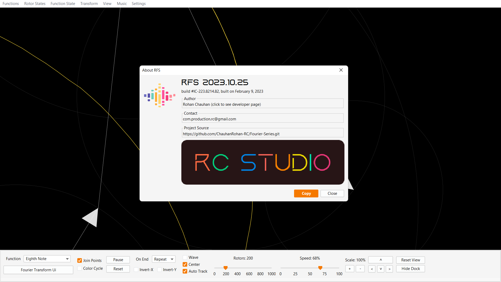
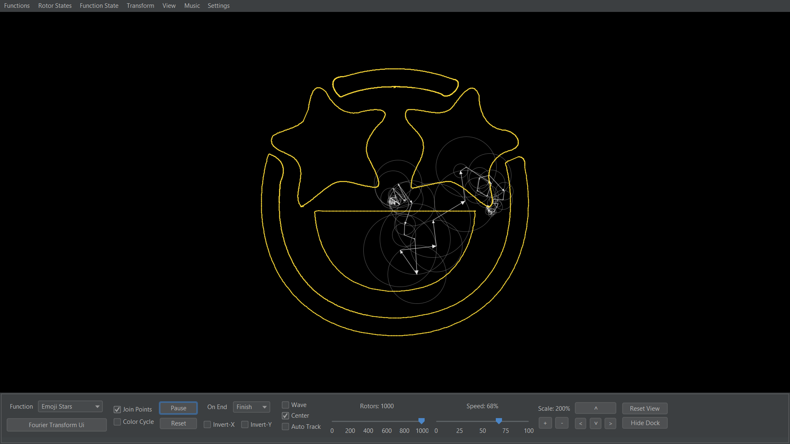
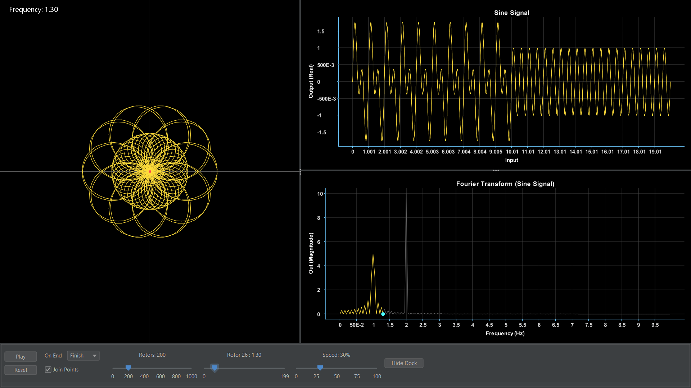
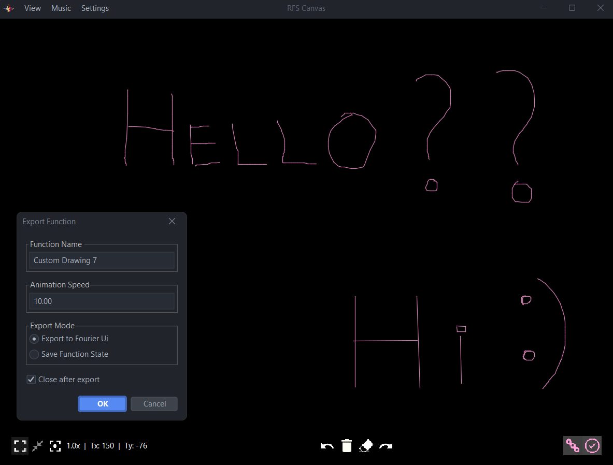
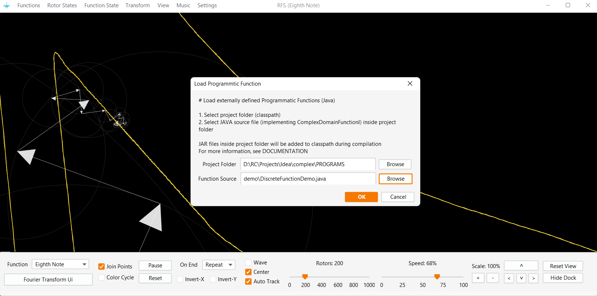
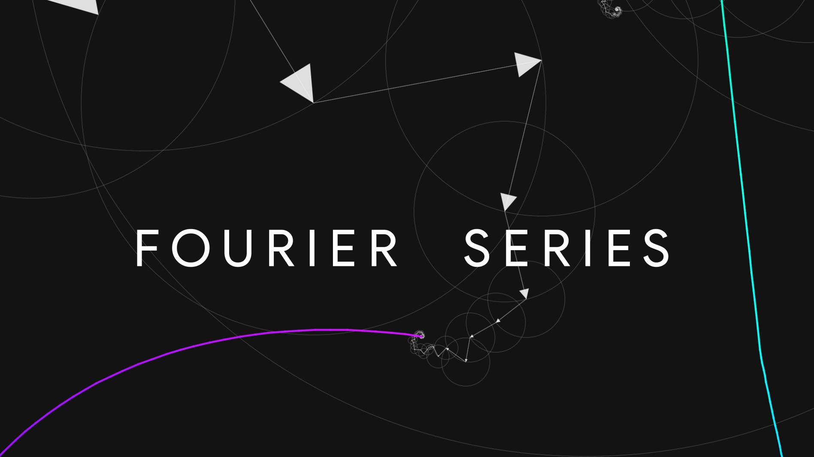

# RFS: Fourier Series And Transform Machine
(RC @May 17, 2022)

#### A software for the simulation and visualization of Fourier Series and Transforms. This program is based on the spring analogy of Fourier Transform and demonstrates the origin of _General and Quantum Uncertainty principle_

#### [View Demo on YouTube](https://www.youtube.com/watch?v=eFbR1_0GCGw)
###### See also
[3D N*N Rubik's Cube solver-AI](https://github.com/ChauhanRohan-RC/Cube.git)  
[Online Multiplayer Ping-Pong AI](https://github.com/ChauhanRohan-RC/Ping-Pong-AI.git)  
[RSA Encryptor](https://github.com/ChauhanRohan-RC/RSA-Encryptor.git)

### Overview
* Approximates any function (real, complex and even discontinuous) in terms of `sines` and `cosines` (rotating vectors)  
####

####
* Fourier Transform Visualization with advance controls
####

####
* In-built JAVA compiler: supports external JAVA projects! No limits to the type, complexity and data of the functions
* Fully extensible: support for external functions, save/load states, modify function definitions etc
* FastMath support, File and Console logging, Customizable integration algorithms
* Configure Frequency Provider: `Fundamental`, `Centering`, `Fixed Start`, `Bounded`, `Custom Defined`
* Customisations: Light/Dark Material themes, Music and Audio feedback, Animation styles etc

### Usage
* Install [Java](https://www.oracle.com/in/java/technologies/downloads/) on your computer and add it to the path
* Clone this repository  
  `git clone https://github.com/ChauhanRohan-RC/Fourier-Series.git`
* Navigate to `out\artifacts\main_jar` and run `launch.bat`.  
  Optionally, open up the terminal and run `java -jar main.jar`

### External Functions support
* External Functions are supported in forms of
   * `SVG` vectors
   * `CSV` data
   * `JSON` states
   * `JAVA` projects using core.jar provided with the framework
* Draw or modify existing custom functions on canvas
####

####
* Export/Import custom drawings in form of SVG

### Programmatic Functions (JAVA)
* Open `PROGRAMS` folder in any Java IDE
* Add `core.jar` to the `classpath`.
* Create a function implementing `ComplexDomainFunctionI` interface or any of its sub-interface like `DiscreteFunctionI`, `SignalFunctionI`, `DiscreteSignalI` etc.
* Alternatively, create a function extending one of the pre-defined subclasses of `ComplexDomainFunctionI` like `DiscreteFunction`, `SignalFunction`, `DiscreteSignal`, `PathFunction`, `GraphicFunction` etc.
* Once you are done with defining the function, start `RFS` by clicking on `launch.bat`.
* Go to `Menu > Functions > Program > Load Project`. Alternatively, press `Shift-L`. A dialog box will appear.
* Select project root directory for `CLASSPATH` and the `[function].java` file for function source
####

####

### Save/Load Function State

* Save Rotor States to as CSV or JSON
* Load saved function states from CSV or JSON
* Edit saved function data to create and load new functions
* Export function plot graphics and data
   * `Output Real`  vs  `Output Imaginary`
   * `Output Real`  vs  `Input`
   * `Output Imaginary`  vs  `Input`
   * `Output Magnitude`  vs  `Input`
   * `Output Phase`  vs  `Input`

## Connect on
[Twitter](https://twitter.com/0rc_studio)  
[Youtube](https://www.youtube.com/channel/UCmyvutGWtyBRva_jrZfyORA)  
[Google Play Store](https://play.google.com/store/apps/dev?id=7315303590538030232)  
E-mail: com.production.rc@gmail.com

