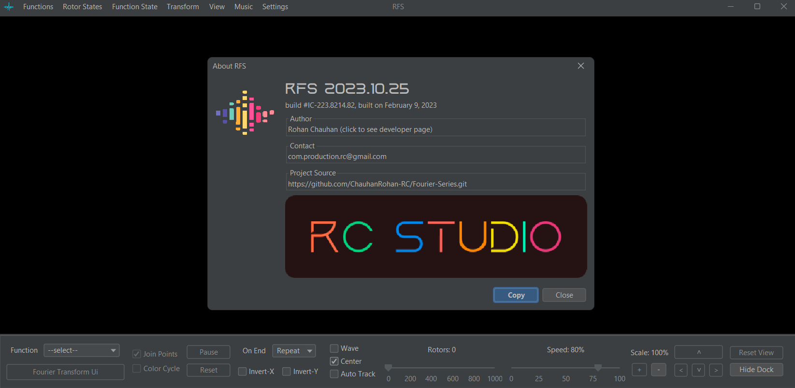

# RFS
(RC @May 17, 2022)

## A mathematical machine based on Fourier Series and Transforms

### Overview

1. Approximates any function (real, complex and even discontinuous) in terms of `sines` and `cosines` (rotating vectors)

2. Fourier Transform Visualization with advance controls

3. In-built JAVA compiler: supports external JAVA projects! No limits to the type, complexity and data of the functions
4. Fully extensible: support for external functions, save/load states, modify function definitions etc
5. FastMath support, File and Console logging, Customizable integration algorithms
6. Configure Frequency Provider: `Fundamental`, `Centering`, `Fixed Start`, `Bounded`, `Custom Defined`
7. Customisations: Light/Dark themes, Audio and Music, Animation styles etc

### Usage

1. Install Java and add it to the environment `PATH` variable
2. Copy directory `out\artifacts\main_jar` to your computer
3. click `launch.bat`

### External Functions support
1. External Functions are supported in forms of
   * `SVG` vectors
   * `CSV` data
   * `JSON` states
   * `JAVA` projects using core.jar provided with the framework
2. Draw or modify existing custom functions on canvas
3. Export/Import custom drawings in form of SVG

### Programmatic Functions (JAVA)
1. Open `PROGRAMS` folder in any Java IDE
2. Add `core.jar` to the `classpath`.
3. Create a function implementing `ComplexDomainFunctionI` interface or any of its sub-interface like `DiscreteFunctionI`, `SignalFunctionI`, `DiscreteSignalI` etc.
4. Alternatively, create a function extending one of the pre-defined subclasses of `ComplexDomainFunctionI` like `DiscreteFunction`, `SignalFunction`, `DiscreteSignal`, `PathFunction`, `GraphicFunction` etc.
5. Once you are done with defining the function, start `RFS` by clicking on `launch.bat`.
6. Go to `Menu > Functions > Program > Load Project`. Alternatively, press `Shift-L`. A dialog box will appear.
7. Select project root directory for `CLASSPATH` and the `[function].java` file for function source

### Save/Load Function State

1. Save Rotor States to as CSV or JSON
2. Load saved function states from CSV or JSON
3. Edit saved function data to create and load new functions
4. Export function plot graphics and data
   * Real vs Imaginary (output space)
   * Real (output) vs Input
   * Imaginary (output) vs input
   * Magnitude (output) vs input
   * Phase (output) vs input

### Demo

1. https://www.youtube.com/watch?v=eFbR1_0GCGw
2. https://www.youtube.com/watch?v=8WbKhzp2rGw

