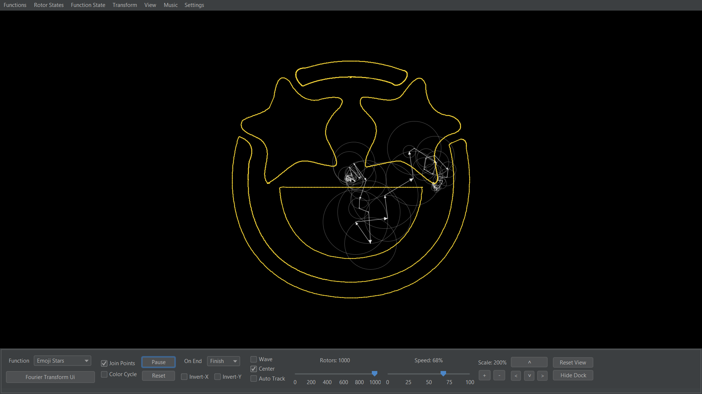
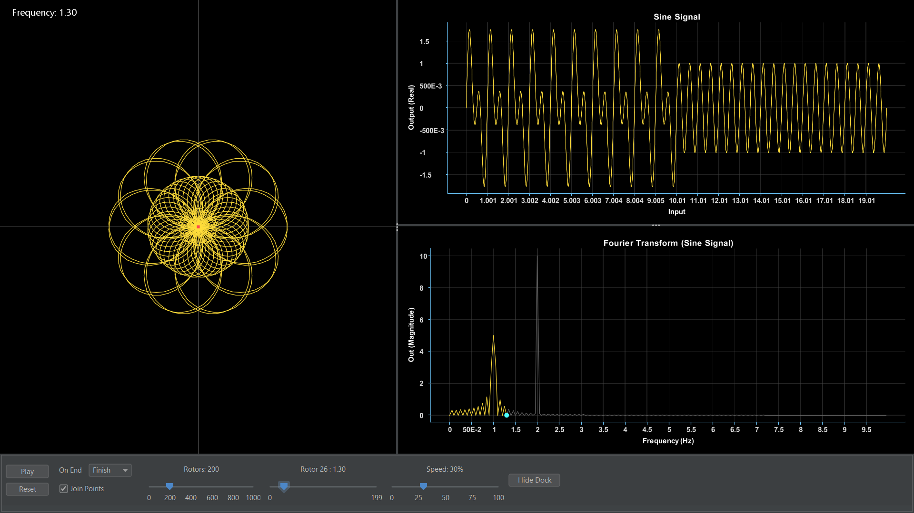
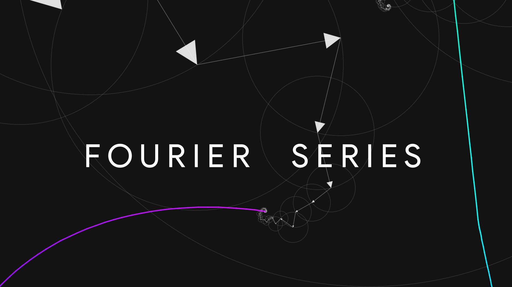

# RFS: Retro Fourier Simulator

This is a mathematical machine for the simulation and visualization of Fourier Series and Transforms. It is based on the **mechanical spring model of the Fourier Transform** and demonstrates the physical origin of _**General**_ and _**Quantum Heisenberg Uncertainty principles.**_

#### NOTE: This software is designed for the demonstration of study "Formulating a novel physical model of the Fourier Transform and proving the General and Quantum Uncertainty Principles" R.Singh, P.Biswas.

### Video Demonstrations
* [RFS Playlist](https://www.youtube.com/playlist?list=PL_oeaRvQxDbR0VYYdoNMh3KZO76d03Psq)
* [RFS Introduction](https://youtu.be/eFbR1_0GCGw)
* [Fourier Transform in RFS](https://youtu.be/yEB2RT1yN-g)
* [Drawing in RFS](https://youtu.be/bWbgRlasApQ)
* [Writing in RFS](https://youtu.be/8WbKhzp2rGw)

###### See also

[3D N*N Rubik's Cube solver-AI](https://github.com/ChauhanRohan-RC/Cube.git)  
[Times Table Simulator](https://github.com/ChauhanRohan-RC/Times-Table.git)  
[RSA Encryptor](https://github.com/ChauhanRohan-RC/RSA-Encryptor.git)

## Usage

* Install [Java](https://openjdk.org/install/) on your computer and add it to the path
* Download the latest release from [GitHub](https://github.com/ChauhanRohan-RC/Fourier-Series/releases/latest).  
  OR  
  Clone this repository using `git clone https://github.com/ChauhanRohan-RC/Fourier-Series.git`  
  and navigate to [out > artifacts > main_jar](out/artifacts/cube_jar) folder
* Open up CMD/Terminal and run command  
  `java -jar main.jar`
* `NOTE:` If the program crashes frequently, go to `Settings > Sound` and uncheck `Play Sounds` and `Play Music`.

## Overview

* Draw any mathematical function or drawing using Fourier Series. The algorithm expresses any given function as a weighed sum of `sines` and `cosines`, which are represented as rotating vectors (or rotors) in the complex plane. These rotors are joined tip-to-tail to trace out the original function / drawing
* Function types
  * Real or Complex valued
  * Continuous or Discrete
  * Periodic or Aperiodic
  * Any combination of the above types

####

####

* Fourier Transform simulation with fine control over the algorithm parameters, visualization graphics and animations

####

####

* Embedded JAVA compiler 
  * Code math functions in java directly within the simulator
  * Import external java projects, with no limits on the quantity and nature of the data used to define functions
* Function operations
  * Support for external vector functions (`.svg`, `.pd`)
  * In built canvas: Draw custom math functions, drawings etc
  * Save / Load / Edit functions and rotor states as `.csv` or `.json`
  * Modify function definitions, by either modifying rotor states or simulation parameters
* Customisations
  * `Light / Dark` Material themes, Dynamic colors
  * Music and Audio feedback
  * Several animation styles

## Algorithm
* Uses a custom integration algorithm, built on top of `Simpson 1/3` and `Simpson 3/8` algorithms 
* Supports complex valued function with optimizations for discrete / aperiodic function 
* FastMath support: Fast and efficient computations of `sin`, `cos`, `exp` and other function through _lazily cached lookup tables_
* File and Console logging for easy debugging and error tracing
* Customizable integration algorithm parameters (`numerical_integration_intervals`, `tolerance`, `discrete_interpolation` etc)

## Frequency Providers
* Rotor Frequency provider defines a contract to assign frequency to each rotor. Choice of an optimal frequency provider depends on the specific function being approximated, and significantly affect the approximation accuracy
* Base interface: [RotorFrequencyProviderI.java](app/core/src/rotor/frequency/RotorFrequencyProviderI.java)
* Use a custom frequency Provider
  * Implement [ComplexDomainFunctionI.java](app/core/src/function/definition/ComplexDomainFunctionI.java) and override its `getFunctionDefaultFrequencyProvider()` method to return a custom [RotorFrequencyProviderI](app/core/src/rotor/frequency/RotorFrequencyProviderI.java) object
  * If you want explicitly defined frequencies, override its `frequenciesExceptExplicitSupported()` method to return `true` and `getExplicitFrequencyProvider()` method to return a custom [ExplicitFrequencyProvider](app/core/src/rotor/frequency/ExplicitFrequencyProvider.java) object
* Available frequency providers
  * Fundamental : returns fundamental frequencies of a function
    * Class: [FundamentalFrequencyProvider.java](app/core/src/rotor/frequency/FundamentalFrequencyProvider.java)
    * Parameter: `centering`  (boolean, optional)
    * For a function, fundamental_frequency = `1 / domain_range`
    * If centering: `rotor_frequency = [rotor_index - (rotor_count / 2)] * fundamental_frequency`
    * else:  `rotor_frequency = rotor_index * fundamental_frequency`
  #####
  * Indices : returns a frequency proportional to the rotor index
    * Class: [IndexFrequencyProvider.java](app/core/src/rotor/frequency/IndexFrequencyProvider.java)
    * Parameter: `index_multiplier`  (float, optional)
    * `rotor_frequency = rotor_index * index_multiplier`
  #####
  * Centering : interpolates frequencies in range `(-rotor_count/2, rotor_count/2)`
    * Class: [CenteringFrequencyProvider.java](app/core/src/rotor/frequency/CenteringFrequencyProvider.java)
    * Parameter: `frequency_multiplier`  (float, optional)
    * `rotor_frequency = [rotor_index - (rotor_count / 2)] * frequency_multiplier`
  #####
  * Fixed Start : returns frequencies starting from a given value and increment
    * Class: [FixedStartFrequencyProvider.java](app/core/src/rotor/frequency/FixedStartFrequencyProvider.java)
    * Parameters: `frequency_start`  (float), `frequency_step`  (float, optional)
    * `rotor_frequency = frequency_start + (rotor_index * frequency_step)`
  #####
  * Bounded : interpolates frequencies within a given range
    * Class: [BoundedFrequencyProvider.java](app/core/src/rotor/frequency/BoundedFrequencyProvider.java)
    * Parameters: `frequency_start`  (float), `frequency_stop`  (float, optional)
    * `rotor_frequency = frequency_start + (frequency_stop - frequency_start) * (rotor_index / rotor_count)`
  #####
  * Explicit : returns explicitly defined frequencies
    * class: [ExplicitFrequencyProvider.java](app/core/src/rotor/frequency/ExplicitFrequencyProvider.java)
    * Parameters: `frequencies` (float array), `sort` (boolean, optional)
    * `rotor_frequency = frequencies[rotor_index]`

### External Functions support

* External Functions are supported in forms of
    * `SVG` vectors
    * `CSV` data
    * `JSON` states
    * `JAVA` projects using core.jar provided with the framework
* Draw or modify existing custom functions on canvas

####

####

* Export/Import custom drawings in form of SVG

### Programmatic Functions (JAVA)

* Open [PROGRAMS](PROGRAMS) folder in any Java IDE and create a new project
* Add [core.jar](out/artifacts/core_jar/core.jar) to the project `classpath`.
* Create a function implementing [ComplexDomainFunctionI](app/core/src/function/definition/ComplexDomainFunctionI.java) interface or any of its sub-interface
  such as  [DiscreteFunctionI](app/core/src/function/definition/DiscreteFunctionI.java), [SignalFunctionI](app/core/src/function/definition/SignalFunctionI.java), [DiscreteSignalI](app/core/src/function/definition/DiscreteSignalI.java), [PathFunctionI](app/core/src/function/path/PathFunctionI.java) etc.
* Alternatively, create a function extending one of the pre-defined subclasses of [ComplexDomainFunctionI](app/core/src/function/definition/ComplexDomainFunctionI.java)
  like [DiscreteFunction](app/core/src/function/definition/DiscreteFunction.java), [DiscreteSignal](app/core/src/function/definition/DiscreteSignal.java), [PathFunction](app/core/src/function/path/PathFunction.java), [GraphicFunction](app/core/src/function/graphic/GraphicFunction.java) etc.
* Once you are done with defining the function, start `RFS` by clicking on `launch.bat`.
* Go to `Menu > Functions > Program > Load Project`. Alternatively, press `Shift-L`. A dialog box will appear.
* Select project root directory for `CLASSPATH` and the `[function class name].java` file for function source

####

####

### Save/Load Function State

* Save Rotor States to as CSV or JSON
* Load saved function states from CSV or JSON
* Edit saved function data to create and load new functions
* Export function plot graphics and data
    * `Output Real`  vs  `Output Imaginary`
    * `Output Real`  vs  `Input`
    * `Output Imaginary`  vs  `Input`
    * `Output Magnitude`  vs  `Input`
    * `Output Phase`  vs  `Input`

## Connect on

[Twitter](https://twitter.com/0rc_studio)  
[YouTube](https://www.youtube.com/channel/UCmyvutGWtyBRva_jrZfyORA)  
[Google Play Store](https://play.google.com/store/apps/dev?id=7315303590538030232)  
E-mail: com.production.rc@gmail.com

